# CubosBank

### Esse README te, como função explicar como executar o projeto Cubos Bank, listando todas as entradas e as possiveis saidas de uma API que simula um app de banco.

### Informações gerais:

- Versão: 1.0.0,
- Descrição: API que simula uma app de banco,
- Titulo: Cubos Bank

### Rotas:

### Listar Contas:

- Metodo: GET
- Rota: /contas
- Validação: via senha geral do banco, enviada pela url query "?senha_banco=Cubos123Bank"
- Descrição: Ao receber como parametro de query a senha do banco, retorna todas as contas registradas no banco de dados.

Respostas:

- Status: 200

- Status: 401, senha do banco incorreta

### Cadastrar nova conta:

- Método: POST
- Rota: /conta
- Validação: via senha geral do banco, enviada pela url query "?senha_banco=Cubos123Bank"
- Descrição: Ao receber como query parametro a senha do banco este endpoint recebe um body com as informações necessárias para a criação d euma nova conta.

json body:

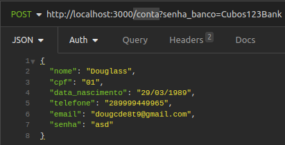

Respostas:

- Status: 201
  Caso todos os requisitos para a execução do endpoint sejam fornecidos.

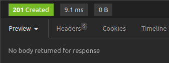

- Status: 401
  Caso a senha geral do banco seja incorreta

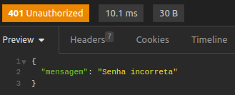

- Status: 400
  Caso falte algum dos elementos do json body, necessários a criação de uma nova conta. Esse estatus de erro tambem será retornado quando o email e/ou CPF da nova conta ja estiverem cadastrados no sistema.

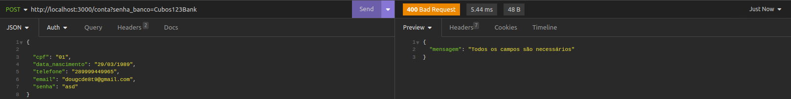
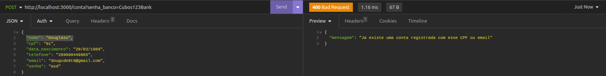

### Atualizar dados de uma conta:

- Método: PUT
- Rota: /conta/:numero_conta
- Validação: Validação: via senha geral do banco, enviada pela url query "?senha_banco=Cubos123Bank"
- Descrição: Ao receber como query parametro o numero de uma conta ja existente no banco de dados, este metodo promove a atualização de quaisquer dados fornecidos para essa conta.

json body:

Respostas:

- Status: 200
  Caso todos os requisitos para a execução desse endpoint sejam fornecidos.

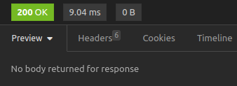

- Status: 404
  Caso seja informado um numéro de conta inexistente no sistema.

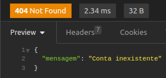

### Excluir conta:

- Método: DELETE
- Rota: /conta/numero_conta
- Validação: Validação: via senha geral do banco, enviada pela url query "?senha_banco=Cubos123Bank"
- Descrição: Endpoint que usa o numero de um conta, pfornecido como query parametro, para deletar a mesma, desde de que, não haja saldo na conta informada.

Respostas:

- Status: 200
  Caso o numero fornecido tenha uma conta referente no banco de ados e esta não tenha saldo.

- Status: 404
  Caso a conta informada não esteja registrada no sistema.

- Status 400
  Caso haja saldo na conta a ser deletada

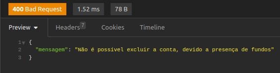

### Deposito / Saque:

- Método: POST
- Rotas: deposito(/deposito/numero_conta) / saque(/saque/numero_conta)
- Validação: Validação: via senha geral do banco, enviada pela url query "?senha_banco=Cubos123Bank"
- Descrição: Ao receber o numero da conta via query parametro, esses endpoints fazem o deposito e o sque de valores maiores que 0 "zero" da conta informada.

Respostas:

- Status: 200
  Caso o numero fornecido tenha uma conta referente no banco de ados e esta não tenha saldo.

- Status: 400
  Caso a valor informado seja negativo ou 0 "zero". Ou quando não a saldo suficiente para o saque.

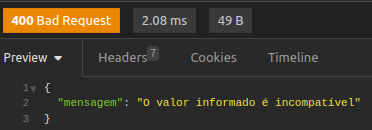
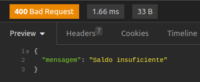

- Status: 404
  Caso a conta informada não existe ano sistema.

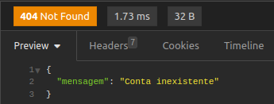

### Transferência:

- Método: POST
- Rota: /transferencia
- Validação: Validação: via senha geral do banco, enviada pela url query "?senha_banco=Cubos123Bank"
- Descrição: Este metodo recebe um corpo json com o numero da conta origem, a conta destino e o valor a ser transferido e com isso promove a transferencia de fundos entre as contas envolvidas.

body json:

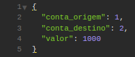

Respostas:

- Status: 200
  Caso todos os inusmos necessários ao endpoint sejam fornecidos da forma correta.

- Status: 400
  Caso não seja fornecido algum dos numeros de conta necessários a operação

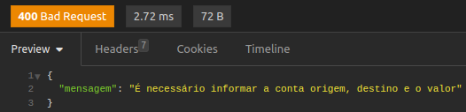

Caso o valor informado seja menor ou igual a zero.

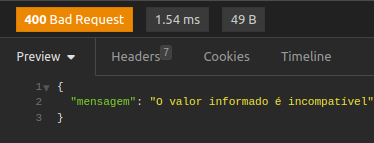

Caso o saldo seja insuficiente.

### Saldo:

- Método: GET
- Rota: /saldo/numero_conta
- Validação: Validação: via senha geral do banco, enviada pela url query "?senha_banco=Cubos123Bank"
- Descrição: Ese metodo recebe como parametro de url o numero da conta e retorna o saldo presente na mesma.

Respostas:

- Status: 200

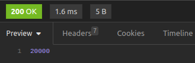

- Status: 404
  Caso a conta não exista no sistema

### Extrato:

- Método: GET
- Rota: /extrato/numero_conta
- Validação: Validação: via senha geral do banco, enviada pela url query "?senha_banco=Cubos123Bank"
- Descrição: Este endpoint tem como função, imprimir todas as atividades realizadas a partir de um conta

Respostas:

- Status: 200

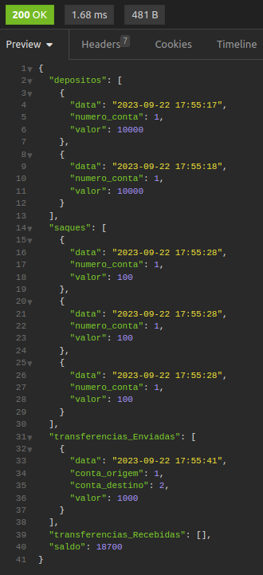

- Status 400
  Caso a conta não exista no sistema.

### Observações gerais:

- Esse projeto ainda esta em adamento, os proximos passos são:

  - A reformulação das validações de cada etapa, para aproximar mais de uma API real;
  - A vinculo deste sistema com um banco de dados reais, para que a persistencia de dados aproxime a API ainda mais da realidade;
  - A refatoração do codigo, visando um codigo mais limpo e eficiente.

- Para a execução do codigo o comando necessário é o (npm run dev)
